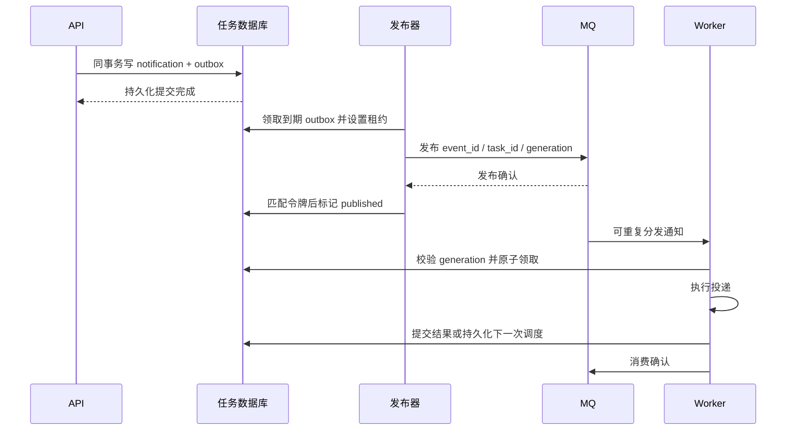
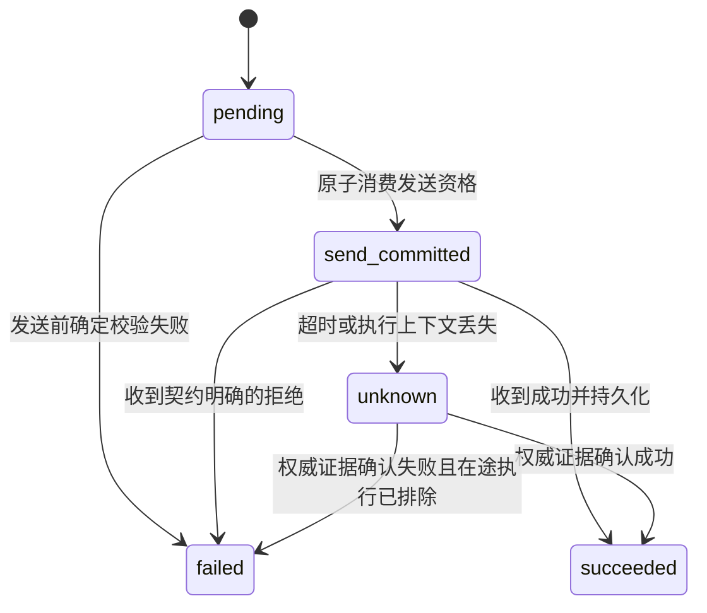

# 故障场景与可靠性扩展设计

状态：后续版本详细设计，尚未开发。本文定义候选协议、数据、事务和恢复流程，不改变当前 MVP。文中的新字段、状态、接口、PostgreSQL 与 MQ 均为拟议能力。

本文承接 [后续版本改进清单](后续版本改进清单.md)，重点展开一致性、持久性、有序投递和非幂等接口的单次投递。当前实现与状态仍以 [核心实体与状态流转](核心实体与状态流转.md) 为准。

## 1. 设计目标与约定

### 1.1 拆开四类承诺

| 目标 | 本方案的约定 | 前提 |
|---|---|---|
| 接收一致性 | 同一调用方的同一事件及目标只创建一个逻辑任务；内容冲突明确拒绝 | 稳定幂等键、可信调用方身份、数据库唯一约束 |
| 任务持久性 | 已确认接收的任务在约定故障范围内可恢复、可查询 | 持久化提交、复制与恢复策略符合约定，禁止恢复后盲目重发 |
| 分组顺序 | 相同业务分组按连续序号推进，不同组可以并行 | 明确序号来源、缺号策略和供应商确认含义 |
| 单次投递 | single_attempt 模式下，本服务最多发起一次应用层 HTTP 请求 | 发送资格不可重置，链路禁用请求级自动重试，接受可能漏发 |

任务记录保存、请求发出、HTTP 接收成功、供应商业务完成分别记录。结果未知需要停下来核查，不能用一个 failed 推断供应商没有执行。

### 1.2 失败模型

覆盖：API/Worker/发布器任意时刻退出、响应或确认丢失、重复消息、乱序到达、网络分区、供应商超时、数据库写入暂时失败、主节点故障和受控备份恢复。

容灾目标必须指定故障范围。例如“单个数据库节点故障时，已确认接收任务的 RPO 为 0”需要相应的同步复制、正确故障切换和旧主隔离；全副本同时损毁不包含在此承诺内。RTO 通过恢复演练确定，本文不预设未经测试的时长。

### 1.3 默认选择

- 任务数据库是状态事实来源；MQ 是可选的分发通道。
- 普通任务使用有限重试，允许重复调用；针对非幂等供应商，可选 single_attempt。
- 顺序范围为 `(client_id, destination_id, ordering_key)`，避免不同调用方或供应商互相阻塞。
- 有序任务的前序失败或结果未知时暂停该组，不自动越过。
- 当前业务方未提供容量和容灾指标，下面的字段与行为形成设计基线，实施前再选定运行参数。

## 2. 候选协议与数据模型

### 2.1 版本化请求

建议通过 `/v2/notifications` 引入新语义，保留 `/v1` 的兼容行为。鉴权凭据映射为可信 client_id；destination_id 引用管理员配置的供应商地址和可用能力，不能由调用方自行声明供应商支持幂等。

```json
{
  "destination_id": "crm-primary",
  "method": "POST",
  "headers": {"Content-Type": "application/json"},
  "body": "{\"order_id\":\"o_123\",\"status\":\"paid\"}",
  "delivery_policy": "retryable",
  "ordering": {"key": "order:o_123", "sequence": 1},
  "retry_deadline": "2026-09-08T00:00:00Z"
}
```

继续使用 Idempotency-Key；同一个逻辑事件通知不同目标时生成不同键。`ordering` 可省略；出现时 key、sequence 必须同时提供，sequence 是大于 0 的整数。分组初始序号默认 1，接入历史业务时通过受控初始化操作设置起点。

服务端限制重试期限与预算，不能让调用方申请无限重试。single_attempt 不接受重试参数。地址映射版本和执行策略随任务保存；后续配置变化不应悄悄将已有请求转发到另一供应商。

### 2.2 数据变更

| 实体 | 关键字段/约束 | 用途 |
|---|---|---|
| notifications 扩展 | client_id、destination_id、destination_version、delivery_policy、retry_deadline、policy_snapshot、request_hash | 固化接收时契约与策略；唯一 `(client_id, idempotency_key)` |
| 调度版本 | dispatch_generation | 每次产生新的调度机会时递增，过滤旧队列通知 |
| 结果信息 | terminal_reason、outcome_uncertain | 分开表达停止原因与曾发生的结果不确定；后者保留到核查消除 |
| 单次资格 | single_send_token、send_committed_at | 持久化消费发送资格，只能从未消费变为已消费 |
| delivery_attempts 扩展 | started_at、send_started_at、completed_at、result_class、execution_token | started_at 表示领取，send_started_at 为尽力记录的本地发起时间；不能将时间记录作为外部执行证明 |
| dispatch_outbox | id、notification_id、generation、available_at、publish_state、publish_token、lease_until、published_at | 同事务记录待分发事件；唯一 `(notification_id, generation)` |
| ordering_groups | client_id、destination_id、ordering_key、next_sequence、state、lease_token、lease_until、version | 分组游标、暂停原因与执行权 |
| 分组消息约束 | 唯一 `(client_id, destination_id, ordering_key, sequence)` | 同序号不得存两条不同任务；无序消息不参与该约束 |
| operation_audits | actor、action、notification_id/group_id、reason、evidence、idempotency_key、created_at | 核查、重放、跳过、暂停和恢复的审计 |

业务方的 business_outbox 存在于业务方数据库，与通知服务的 dispatch_outbox 责任不同：前者防止业务提交后未通知，后者防止通知入库后未分发。

### 2.3 候选状态

普通任务保留 pending、processing、retry_wait、succeeded、failed。新增 unknown 用于已停止自动投递、需要核查的结果；single_attempt 另用 send_committed 表示发送资格已消费。单次与普通任务共用表时，按 delivery_policy 校验允许的迁移。

分组状态使用 active、paused_failure、paused_unknown、paused_gap。组内后续任务可继续接收，但 eligibility 由组游标决定，等待时不占用网络执行槽位。

## 3. 一致性：把接收责任逐段交接

### 3.1 业务事务到通知服务

1. 业务方在同一事务内更新业务数据、生成稳定 event_id，并写 business_outbox。
2. 事务提交后，业务方发布器调用通知服务，始终使用原 event_id 派生的幂等键。
3. 收到明确的 202 或同内容去重 200 后，将本地事件标为已交接。
4. 请求超时或响应丢失，保留事件并按原键重试。
5. 收到内容冲突或协议错误，标记接入异常并告警，不能自动更换幂等键绕过。

这样业务数据回滚时不会产生应当执行的通知，业务数据提交后发送器退出也能继续交接。采用同事务 Outbox 的依据见 [AWS 设计指南](https://docs.aws.amazon.com/prescriptive-guidance/latest/cloud-design-patterns/transactional-outbox.html)。

### 3.2 通知接收事务

事务内顺序：

1. 依据 client_id 与幂等键查询或插入通知；数据库唯一约束处理并发冲突。
2. 同键同摘要返回已有任务，不能产生新的分发事件；同键不同摘要返回 409。
3. 有序任务校验分组与序号唯一性；同序号换一个幂等键也不能创建第二次执行。
4. 首次任务写 pending、generation=1，并写对应 dispatch_outbox。
5. 完成持久化提交后返回 202。事务提交结果不确定时，调用方原键重试。

校验失败不写任务；入库后尚未分发属于已经接收，后续责任留在通知服务。用于去重判断和关键状态核查的读请求访问权威数据库，避免读取滞后副本后误报不存在。

### 3.3 Outbox 到 MQ



MQ 消息只包含内部 ID、generation 和追踪标识，不复制供应商凭据或请求 Body。发布器只有在确认成功路由并获得所选队列的持久化确认后才标记 published。以 RabbitMQ 为例，发布确认与消费确认各自覆盖不同交接边界，配置必须分别处理。[RabbitMQ 官方说明](https://www.rabbitmq.com/docs/confirms)

关键分支：

- 发布前退出：Outbox 租约到期后重新发布。
- MQ 已接收但确认丢失：重复发布同一个 event_id，消费者通过任务状态与 generation 去重。
- 确认后、published 写回前退出：仍可能重复发布，处理同上。
- 无法路由、队列不可用或确认超时：不得删除 Outbox；记录错误并重试或告警。
- published 只表示分发完成，不代表 HTTP 成功；对账器可再次提醒长期未领取的到期任务。

### 3.4 消费与重试事务

Worker 收到 MQ 消息后先检查数据库：

| 数据库情况 | 行为 |
|---|---|
| 终态或消息 generation 已过期 | ACK，禁止再次调用供应商 |
| 到期、可领取、顺序资格符合 | 原子领取并创建尝试，提交后调用 HTTP |
| 已有有效 processing 租约 | ACK 这条重复提示；持久化租约回收负责中断恢复 |
| 未到期或被分组前序阻塞 | ACK 提示；到期调度器/分组推进负责重新产生有效调度提示 |
| 数据库不可用 | 不执行 HTTP；停止拉取或延迟重投，避免紧密重试循环 |
| 任务不存在 | 隔离并告警，核查环境或恢复异常；不能从队列内容凭空重建请求 |

结果写回事务同时更新 notification、attempt；需要重试时增加 generation、写 next_attempt_at 和新 Outbox，然后 ACK。发布器只发布 available_at 到期的事件。

如果外部已经成功但结果事务失败，普通重试模式在租约回收后可能再次执行，这是明确的重复窗口；single_attempt 按第 6 节处理。结果已提交、ACK 丢失时，重投消息被数据库状态过滤。

MQ 引入后仍保留低频对账扫描，查找过期租约、到期未分发和组游标已推进但未被唤醒的任务。修复提示使用唯一约束与版本检查，避免每次扫描制造无限重复事件。

## 4. 持久性与长期故障恢复

### 4.1 数据库与故障切换

- 单机阶段沿用事务落盘；多机目标采用 PostgreSQL 等支持复制的数据库。
- 对“单节点故障不丢已确认任务”的目标，要求提交确认覆盖指定同步副本的持久化 WAL；同步副本不足时宁可阻塞或拒绝接收，也不能静默降级后继续宣称 RPO=0。
- 只提升符合复制进度条件的副本；隔离旧主写入和旧 Worker 的发送能力，防止双主及恢复后的双重执行。
- 复制保障与备份保障分别建设：复制处理节点故障，备份和日志归档处理误删等恢复需求。PostgreSQL 对同步与异步复制的取舍见 [官方文档](https://www.postgresql.org/docs/current/warm-standby.html)。

### 4.2 恢复备份的特殊风险

恢复较早备份可能把“已经发送”的任务恢复成 pending。数据库备份看似恢复成功，重新投递却会造成重复副作用。

恢复流程应为：停止入口和所有 Worker → 恢复数据 → 核对恢复点与外部操作记录 → 隔离可能回退的发送窗口 → 对账 → 人工批准后开放执行。

single_attempt 的一次性标记属于不可回退的安全证据。若恢复后的数据无法证明该资格从未被消费，任务进入 unknown；不能自动重新开放资格。可采用独立持久化审计记录辅助对账，但只有其写入和恢复保障符合契约时才可作为证据。

### 4.3 重试期限与失败处理

候选普通策略：总共最多 20 次尝试、期限默认 24 小时、指数退避基数 5 秒且上限 1 小时，附加抖动。它们是实施前可调整的起点，截止时间是硬边界，并不保证尝试机会覆盖完整 24 小时。

- 下一次执行时间取退避与 Retry-After 指定时间中较晚者。
- 下一次时间超过 retry_deadline，进入 failed，原因 deadline_exceeded；不提前请求规避供应商等待要求。
- 鉴权失败、参数错误等确定不应重试的结果立即终止；不要靠增加次数解决配置错误。
- 提供按供应商、错误类型、年龄筛选的失败列表，告警只在状态变化或超过阈值时触发。
- 普通任务人工重放需要新的受审计恢复操作，保留原事件身份与尝试历史；重放前显示结果不确定风险。
- single_attempt 的重放操作直接拒绝；其核查流程只能记录证据，不重新消费发送资格。

### 4.4 对账与观测

建议指标：未发布 Outbox 数及最老年龄、任务到期等待时长、processing 租约超时数、失败原因分布、unknown 数、暂停分组数、Worker 心跳、数据库复制延迟与备份年龄。

对账按稳定 ID 比较业务 Outbox、通知任务、分发事件与供应商操作记录。保存任务记录、尝试记录、幂等墓碑和分组序号的保留期限，清理请求敏感内容时仍保留防止历史重复所需证据。

## 5. 有序投递详细方案

### 5.1 顺序范围与序号

例如同一订单需要依次通知 created、paid、shipped，使用同一个 ordering_key，sequence 分别为 1、2、3。不同订单可以并行。

序号由业务方在业务事务内生成，按“投递给该目标的有序消息流”连续编号。如果直接使用业务全量事件序号，而某些事件不通知该供应商，会制造永久缺号，应在接入协议中避免。

同一个 key 代表同一连续流，不能删除分组后以同 key 从 1 再次开始；新的业务生命周期使用新 key。并发收到 sequence=2、1 时可都先持久化，但只执行 1。

### 5.2 原子领取与推进

1. 调度器查找 active 分组的 next_sequence 对应任务。
2. 在短事务中锁定分组记录，校验游标、租约和通知执行策略。
3. 同事务领取该任务并设置组执行权；事务结束后才发送 HTTP。
4. 得到符合顺序契约的成功确认后，同事务完成任务、释放执行权、将 next_sequence 加一，并生成后序任务调度提示。
5. 可重试失败保持游标不动；重试等待期间不占用网络执行槽位。
6. 最终失败转 paused_failure；结果不确定且无法安全重试时转 paused_unknown。

若调度器发现应有序号迟迟未到，超过配置的缺号等待阈值转 paused_gap 并告警。补齐后通过受控核查恢复 active；不能悄悄跳到已到达的最大序号。

### 5.3 超时、旧 Worker 与业务完成顺序

普通无序重试可以接受重复；严格有序的非幂等业务遇到前序超时，不能仅等待租约过期就放心推进。

例如旧请求 1 在供应商侧仍在处理，新 Worker 重试 1 后又发出 2，旧请求 1 最后生效，就可能倒退业务状态。发送端的组锁只能控制本地资格，无法阻止这种迟到的外部副作用。

因此分两种目标能力：

- **供应商支持业务顺序协议**：请求带稳定 operation_id 与 sequence；供应商原子校验预期序号、去重并更新业务。旧序号重复请求返回已有结果，缺少前序时拒绝越序。若业务副作用跨越外部系统，还需把保证延伸到该下游。
- **供应商仅提供普通 HTTP**：承诺本服务按确认顺序串行发起；对于结果未知的前序暂停核查。HTTP 202 等异步接收响应只能证明受理，严格业务完成顺序需等待权威完成结果再推进。

### 5.4 跳过和恢复

候选管理操作 `POST /v2/ordering-groups/{id}/resolve` 要求管理权限、幂等操作键、原因和证据。允许确认已完成、补齐缺失事件或经业务批准跳过。

跳过意味着该点放弃完整顺序，应写审计记录并通知业务方。失败分组恢复时先核对游标和任务终态，不按队列到达顺序推断业务位置。

## 6. 非幂等接口的单次投递详细方案

### 6.1 契约

single_attempt 的承诺是本服务最多发起一次应用层 HTTP 请求。TCP 数据包重传不等于第二次应用请求；客户端、网关、服务网格和代理的请求级重试必须关闭。

接受代价：发送资格消费后、真正发出前退出，可能漏发；超时后可能无法获知供应商是否已经执行。任务记录可以完整保留，但不能因此保证业务必达。

### 6.2 执行步骤

1. 完成鉴权、目标校验、编码与请求构造预检查。
2. 在事务中检查任务 pending、single_send_token 为空且顺序资格满足。
3. 原子写 send_committed、唯一 single_send_token、send_committed_at 和本次尝试，提交后才有资格发送。
4. 只有刚刚成功消费资格的执行上下文执行 HTTP；以后任何重新加载任务的执行者都不能获得该资格。
5. 收到明确 2xx 并写回时为 succeeded；收到确定拒绝按供应商契约记录 failed；超时、响应丢失、5xx 等可能执行过的结果保守记录 unknown。
6. 发送后结果写回暂时失败，可以在原执行上下文中重复写数据库结果，不能再次发 HTTP。进程退出后转核查流程。



send_committed 不能通过租约回收回到 pending，也不产生第二条自动投递尝试。当前 MVP 的普通 recover 逻辑不能直接复用到此模式。

unknown 表示禁止后续自动发送的核查状态，并不能停止原进程或供应商仍在执行的请求。管理操作推进同组后序之前，应确认旧发送上下文已停止且远端在途执行已被排除或已完成。

### 6.3 不确定结果核查

候选接口 `POST /v2/notifications/{id}/reconcile` 只处理授权核查：保存查询证据、确认结果和审计记录，不提供“重置 single_send_token”。

如果供应商查询返回“暂时不存在”，保持 unknown，因为旧请求可能尚未提交或查询索引存在延迟。只有供应商协议能证明操作不会再发生，或提供原子取消/最终否定结果，才能记录确定失败并安全处理后续顺序。

### 6.4 必须执行一次且不能重复时

若业务不能接受漏发，则不能选择上述 single_attempt 契约。需要供应商支持原子去重：

1. 接收稳定 operation_id 和请求摘要。
2. 在供应商本地事务内，以 operation_id 唯一约束判重；同 ID 不同内容拒绝。
3. 同事务提交业务修改、去重记录和结果。
4. 重复调用返回已保存结果；发送端允许重试相同 operation_id。

这允许网络请求重复，但使契约覆盖的业务事务只生效一次。若供应商业务处理继续调用另一个非幂等系统，仍需要处理新的外部故障窗口；在供应商前面简单增加缓存去重代理也无法消除该窗口。

## 7. 故障场景与预期处理矩阵

| 场景 | 普通重试策略 | single_attempt / 有序要求 |
|---|---|---|
| 业务已提交但尚未调用通知服务 | business_outbox 恢复发送 | 同样恢复，尚未消费投递资格 |
| API 已入库，响应丢失 | 原幂等键重试返回原任务 | 相同规则，不能重新创建发送资格 |
| Outbox 发布确认丢失 | 可重复发布，消费查库去重 | 同样去重，send_committed 不再发送 |
| 领取后、HTTP 前退出 | 租约到期重新领取 | 未消费单次资格可恢复；已消费进入核查，可能漏发 |
| 外部已执行，响应丢失 | 可能重复，依赖供应商幂等减少副作用 | unknown，不重发；严格有序组暂停 |
| HTTP 成功、数据库写回失败 | 租约恢复可能重复 | 原上下文只重写结果；退出后核查 |
| 结果提交后、MQ ACK 丢失 | 重复消费读取终态后 ACK | 相同规则 |
| 同组 sequence=2 先到 | 保存等待 sequence=1 | 不占执行槽位，超阈值告警缺号 |
| 前序任务永久失败 | 无序其他任务继续 | 同组暂停，其他组继续 |
| 恢复旧备份导致状态回退 | 暂停并对账，防止大量重复 | 单次资格无法证明安全时保持 unknown，禁止重置 |
| 同步副本不可用 | 按一致性契约阻塞/拒绝新确认 | 不静默降低持久性保证 |

## 8. 后续验收计划

以下测试均为未来实现的验收要求，不属于当前已通过的 42 项测试。

| 编号 | 故障注入 | 通过条件 |
|---|---|---|
| C01 | 业务事务提交后杀掉发布器 | 重启后原事件交接成功，通知逻辑任务唯一 |
| C02 | API 提交后丢弃响应并并发原键重试 | 同一 client/key 只有一个任务，不产生额外资格 |
| C03 | MQ 确认后、Outbox 写回前杀进程 | 出现重复分发但无重复领取；所有任务可追踪 |
| C04 | 结果提交后丢弃消费 ACK | 重投不再次调用已终态任务 |
| D01 | 主节点故障并切换到合格副本 | 约定故障范围内已确认任务存在，旧主与旧执行者被隔离 |
| D02 | 从较早备份恢复 | Worker 默认关闭，风险窗口被隔离并经对账后开放 |
| O01 | 同组 2、1 乱序到达 | 按 1、2 推进，其他组并行 |
| O02 | 前序超时/缺号/永久失败 | 分别进入核查、缺号或失败暂停，不越序 |
| O03 | 旧请求延迟完成且切换消费者 | 根据供应商协议去重校验；不具备能力时暂停而非虚报业务顺序 |
| S01 | 单次资格提交前后分别杀进程 | 提交前可恢复；提交后最多一次发起，允许未发送 |
| S02 | 单次请求已产生副作用但响应丢失 | 状态 unknown；重启、重复 MQ 与管理重放均不再发送 |
| S03 | 查询暂不存在，随后原请求完成 | 保持核查，不据暂时不存在自动补发或越序 |

核对依据包括数据库记录、供应商模拟端的请求次数和副作用次数、审计操作与消息确认时间。单靠日志条数不能证明供应商执行次数。

## 9. 实施前需要确认的业务决策

| 决策 | 当前建议 | 改变建议会影响什么 |
|---|---|---|
| 普通通知最多等待多久 | 可配置次数和截止时间，候选 20 次/24 小时 | 重试压力、积压容量和业务时效 |
| 非幂等接口能否接受漏发 | 选择 single_attempt 即明确接受 | 不接受则必须获得供应商原子去重或事务能力 |
| 顺序含义 | 按业务分组，严格要求需约定业务完成确认 | 仅 HTTP 接收确认不足以证明业务生效顺序 |
| 前序失败能否跳过 | 默认暂停，仅审计授权后跳过 | 跳过会放弃该处完整顺序 |
| 容灾范围与恢复时间 | 先定义单节点故障目标，再演练确定 RTO | 同步复制、基础设施成本及可用性取舍 |

本阶段把决策点和建议写清，不要求立即开发或选择基础设施。后续启动对应版本时，再依据真实供应商能力和业务指标确认这些契约。
