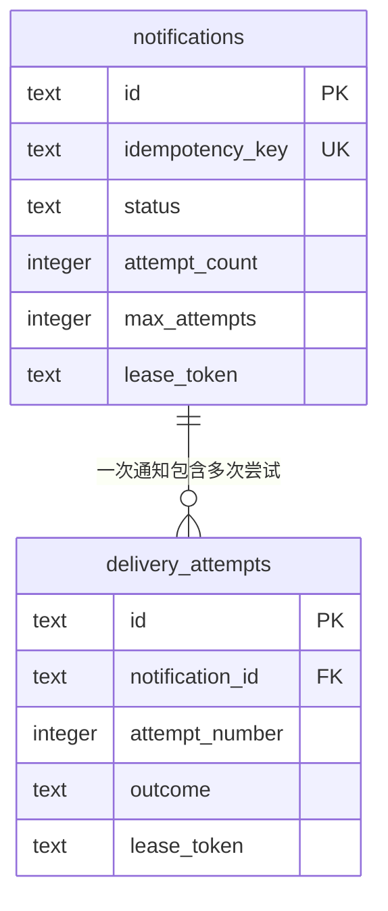
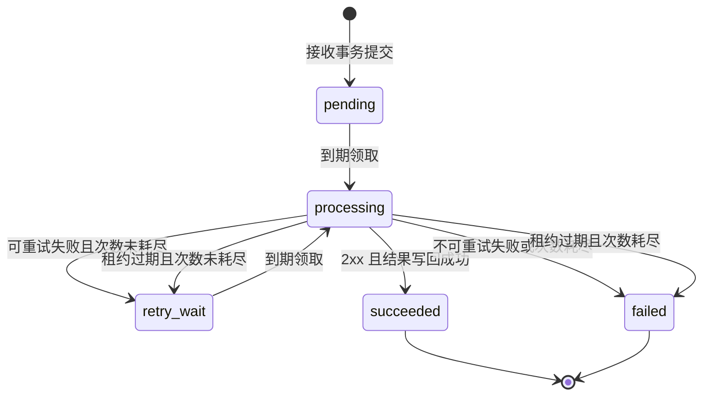
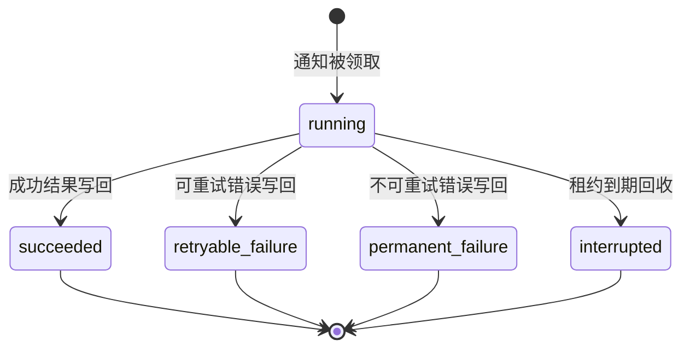
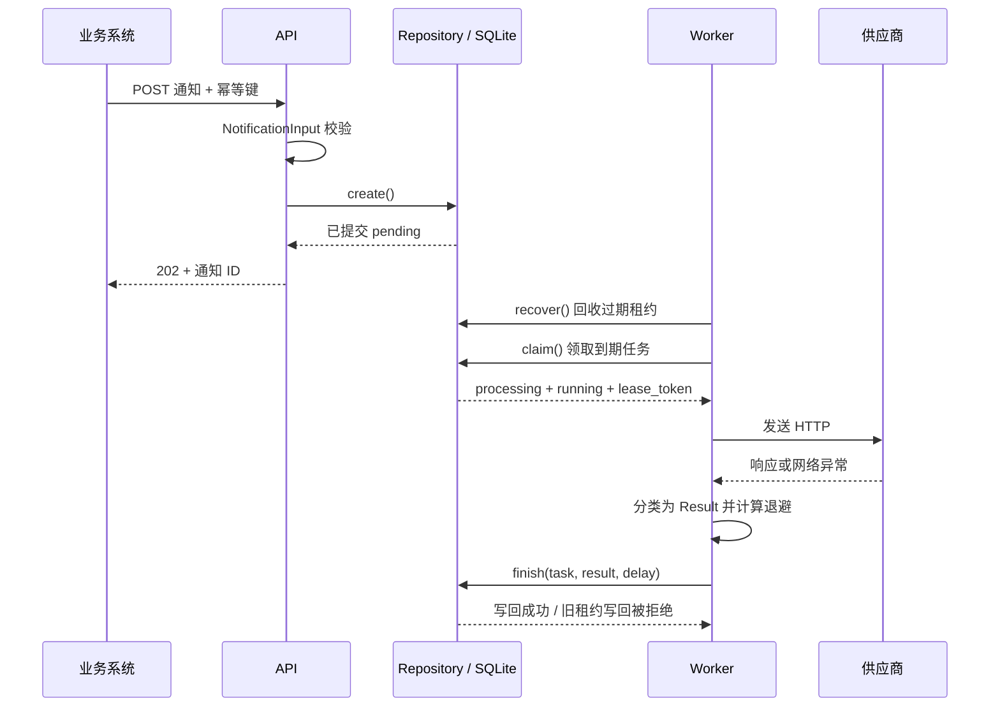

# 核心实体与状态流转

本文对照当前 MVP 代码编写，仅描述已经实现的对象和行为。

## 1. 重要实体与类一览

系统的核心业务实体是通知任务和投递尝试，分别保存在 `notifications` 与 `delivery_attempts` 表中。Repository 负责实体的存取和状态更新，数据库 CHECK 约束限定有效状态。

| 名称 | 实际形式与位置 | 职责 | 是否持久化、有无业务状态 |
|---|---|---|---|
| `NotificationInput` | [protocol.py](../src/notification_service/protocol.py) 中的 Pydantic 模型 | 校验提交的 URL、方法、Header 和 Body，计算请求摘要 | 模型本身不持久化；无状态字段 |
| 通知任务 | [storage.py](../src/notification_service/storage.py) 中的 `notifications` 表 | 保存一个通知的请求内容、调度信息与整体结果 | 持久化；有 `status` |
| 投递尝试 | [storage.py](../src/notification_service/storage.py) 中的 `delivery_attempts` 表 | 保存某次领取后执行的过程与结果 | 持久化；有 `outcome` |
| `Result` | [delivery.py](../src/notification_service/delivery.py) 中的不可变 dataclass | 表达一次 HTTP 调用的分类结果，交给 Repository 写回 | 内存对象，结果字段写入通知与尝试记录 |
| `Settings` | [config.py](../src/notification_service/config.py) 中的不可变 dataclass | 保存鉴权、数据库路径、目标允许列表及执行参数 | 运行时配置；无业务状态 |
| `Repository` | [storage.py](../src/notification_service/storage.py) 中的类 | 管理事务、查询、领取、写回和回收 | 运行时数据访问对象 |
| `Worker` | [worker.py](../src/notification_service/worker.py) 中的类 | 轮询、控制并发、执行 HTTP、调用 Repository | 运行时调度对象 |

辅助异常：`Conflict` 表示幂等键对应不同请求，API 转为 409；`APIError` 封装接口错误的 HTTP 状态、错误码和安全提示。

## 2. 实体之间的关系



- 一个通知刚创建时没有尝试记录。
- 每次成功领取，新增一条尝试记录，并将通知的 `attempt_count` 加一。
- `(notification_id, attempt_number)` 有唯一约束。
- 重试复用原通知 ID，但生成新的尝试 ID 和租约令牌。
- `idempotency_key` 标识调用方的重复提交；`lease_token` 标识某次执行资格，两者用途不同。

## 3. 通知任务 notifications

### 3.1 重要字段

| 字段 | 含义与使用规则 |
|---|---|
| `id` | 服务生成的通知 UUID，对外查询使用 |
| `idempotency_key` | 调用方提供，MVP 服务内全局唯一 |
| `request_hash` | 规范化请求的 SHA-256 摘要，与幂等键配合判断重复或冲突 |
| `url`、`method` | 供应商地址和 HTTP 方法 |
| `headers_json`、`body_text` | 待发送 Header 与原始 UTF-8 文本；查询接口不返回这些内容 |
| `status` | 整个通知的当前状态 |
| `attempt_count` | 已成功领取的次数，不等于供应商实际收到的次数；初始为 0 |
| `max_attempts` | 创建时从配置复制到任务中的尝试上限，默认 5；包括首次 |
| `next_attempt_at` | 下一次允许领取的时间；创建时为当前时间，重试时为当前时间加等待间隔 |
| `lease_token` | 本次领取生成的 UUID；正常写回必须匹配 |
| `lease_expires_at` | 本次领取资格的截止时间 |
| `last_http_status` | 最近已记录尝试的 HTTP 状态码；没有 HTTP 响应时为 NULL |
| `last_error_code`、`last_error_message` | 最近已记录错误，或任务终止原因；成功写回后清空 |
| `created_at`、`updated_at` | 创建和最近状态更新时间 |
| `completed_at` | 进入 succeeded/failed 的时间，其余状态为 NULL |

数据库时间为 Unix 时间戳秒数（REAL），API 输出转换为 UTC RFC 3339 字符串。`last_*` 在再次领取时不会清空，因此 processing 期间可能仍显示上一次尝试的信息，不能把它当作当前在途请求的结果。

### 3.2 状态定义

| status | 中文含义 | 能否被领取 | 能否自动离开该状态 |
|---|---|---|---|
| `pending` | 已持久化，等待首次投递 | 到期且次数未耗尽时可以 | 可以，领取后 processing |
| `processing` | 已领取，等待本次执行结果写回 | 不可以再次正常领取 | 可以，正常写回或租约回收 |
| `retry_wait` | 失败或中断后等待再次投递 | 到期且次数未耗尽时可以 | 可以，领取后 processing |
| `succeeded` | 已记录 HTTP 2xx 成功结果 | 不可以 | 不可以，终态 |
| `failed` | 不可重试失败或次数已耗尽 | 不可以 | 不可以，终态 |

processing 表示已领取，不表示 HTTP 请求一定已发出。succeeded 仅表示本服务按 HTTP 协议判定送达；failed 也不能证明供应商一定未执行。

### 3.3 通知状态图



所有箭头代表持久化事务完成后的状态。HTTP 返回成功，但数据库写回失败时，不会进入 succeeded。

### 3.4 每次迁移修改哪些数据

| 触发方法 | 条件 | 通知变化 | 尝试变化 |
|---|---|---|---|
| `Repository.create()` | 首次提交且校验通过 | 新建 pending；次数 0；next_attempt_at 为当前时间 | 不创建尝试 |
| `Repository.claim()` | pending/retry_wait，到期，次数小于上限 | processing；次数 +1；生成租约；清空 next_attempt_at | 新建 running |
| `Repository.finish()` | 成功结果，且租约仍有效 | succeeded；填 completed_at；清租约；清错误 | running → succeeded |
| `Repository.finish()` | 可重试失败，仍有次数 | retry_wait；设置 next_attempt_at；清租约 | running → retryable_failure |
| `Repository.finish()` | 可重试失败，次数耗尽 | failed；错误码 attempts_exhausted；填 completed_at；清租约 | running → retryable_failure，保留本次原始错误分类 |
| `Repository.finish()` | 不可重试失败 | failed；保留错误分类；填 completed_at；清租约 | running → permanent_failure |
| `Repository.recover()` | processing 租约过期，仍有次数 | retry_wait；next_attempt_at 为回收时间；清租约；错误码 worker_interrupted | running → interrupted |
| `Repository.recover()` | processing 租约过期，次数耗尽 | failed；填 completed_at；清租约；错误码 attempts_exhausted | running → interrupted |

正常失败重试有退避等待；当前中断回收直接设为到期可领取，不附加相同退避。回收每个事务最多处理 100 条过期任务，后续轮询继续处理剩余记录。

## 4. 投递尝试 delivery_attempts

### 4.1 重要字段

| 字段 | 含义 |
|---|---|
| `id` | 本次尝试 UUID |
| `notification_id` | 所属通知 UUID，外键 |
| `attempt_number` | 第几次领取，从 1 开始 |
| `lease_token` | 与这次领取生成的令牌对应，历史中保留 |
| `outcome` | 本次尝试的状态或结果 |
| `started_at` | 领取时间，不是精确的网络发送时刻 |
| `finished_at` | 正常写回时刻；中断时是回收发现时间 |
| `duration_ms` | 投递函数测量的耗时，不包含领取事务及结果写回时间；中断时为 NULL |
| `http_status` | 本次收到的 HTTP 状态码，没有响应时为 NULL |
| `error_code`、`error_message` | 本次安全错误分类和摘要；不保存原始响应 Body 或异常秘密 |

### 4.2 尝试状态图



| outcome | 含义 |
|---|---|
| `running` | 本次已开始，尚未完成写回或回收 |
| `succeeded` | 本次收到成功结果并写回 |
| `retryable_failure` | 错误类型允许重试；是否真的继续，由通知剩余次数决定 |
| `permanent_failure` | 当前策略判定不应自动重试，并非宣称供应商永远无法修复 |
| `interrupted` | 租约过期，本服务没有可靠记录本次最终结果，可能根本未发送，也可能已执行 |

一条尝试记录结束后不会回到 running。后续重试创建新记录，保留原记录作为历史。

## 5. Result 如何驱动状态

`Result` 是不可变的内存结果对象，由 `deliver()` 返回，再由 `Worker.process()` 交给 `Repository.finish()`。

| 字段 | 含义 |
|---|---|
| `success` | 是否收到 HTTP 2xx |
| `retryable` | 错误类别是否可重试，不判断剩余次数 |
| `http_status` | HTTP 状态码或 None |
| `code`、`message` | 安全错误分类和提示，成功时为 None |
| `retry_after` | 429/503 响应中的 Retry-After 原值，供计算下次时间 |
| `duration_ms` | 本次投递函数耗时 |

| 投递结果 | Result 的关键值 | 正常写回后通知状态 |
|---|---|---|
| HTTP 2xx | success=True，retryable=False | succeeded |
| HTTP 408/429/5xx | success=False，retryable=True | retry_wait 或次数耗尽后的 failed |
| 超时、可重试网络错误 | success=False，retryable=True | retry_wait 或 failed |
| 3xx、其余 4xx、TLS 验证失败、目标不允许、请求无法构造 | success=False，retryable=False | failed |

如果投递函数异常退出或结果写回失败，没有持久化结果可供使用，任务保持 processing、尝试保持 running，直到租约回收。不能将内存中得到的 Result 直接视为数据库已经完成的事实。

## 6. Repository 与 Worker 如何协作



Worker 内部 `active` 集合存储正在执行的 asyncio.Task，`stop` 是停止信号。这些都是进程内调度信息，重启后不会恢复；恢复依赖数据库中的通知、尝试和租约。

Settings 控制默认参数。任务创建时固化 max_attempts，其他执行配置由当前进程读取。

## 7. 状态流转的保护规则

1. **领取与创建尝试原子完成**：同一短事务中更新通知和新增尝试，避免只更新其中一张表。
2. **结果与尝试原子写回**：正常 finish 在同一事务更新两张表。
3. **旧执行者不能覆盖结果**：finish 要求任务仍为 processing、令牌匹配，且 lease_expires_at 大于当前时间；不满足返回 False，不修改状态。
4. **网络调用不持有数据库事务**：避免供应商慢响应长时间阻塞数据库写入。
5. **重复提交不触发状态迁移**：相同幂等键和请求摘要返回已有任务；不同摘要返回 409，原任务不变。
6. **终态不会自动重开**：当前没有重放或取消接口，succeeded/failed 不会重新变成 pending。
7. **任务次数与尝试结果分开解释**：attempt_count 按领取计数；retryable_failure 不意味着一定会有下一次尝试。
8. **租约保护的是本地状态**：无法撤回供应商已经处理的请求，也不能保证对方恰好执行一次。

## 8. 三个完整例子

### 8.1 第一次失败，第二次成功

```text
通知：pending → processing → retry_wait → processing → succeeded
尝试 1：running → retryable_failure（HTTP 503）
尝试 2：running → succeeded（HTTP 204）
最终 attempt_count = 2
```

### 8.2 连续超时，用完五次机会

```text
前四次：processing → retry_wait
第五次：processing → failed
五条尝试记录均为 retryable_failure，错误码 request_timeout
通知最终错误码 attempts_exhausted
```

错误类型仍可重试，但策略预算已经耗尽，因此整体任务终止。

### 8.3 Worker 在发送后退出

```text
通知 processing，尝试 1 running
→ Worker 退出，数据库中状态暂时不变
→ 租约过期后 recover()
→ 尝试 1 interrupted，通知 retry_wait（假设还有次数）
→ 新领取创建尝试 2，通知 processing
→ HTTP 2xx 并写回，尝试 2 succeeded，通知 succeeded
```

供应商可能在第一次就已执行，所以第二次是重复请求。结果未知通过错误提示与 interrupted 表达。

## 9. 对应测试入口

- [test_storage.py](../tests/test_storage.py)：原子领取、租约过期、旧结果拒绝、耗尽及终态去重。
- [test_delivery.py](../tests/test_delivery.py)：Result 分类、超时、重试计算、写回失败后的恢复责任。
- [test_e2e.py](../tests/test_e2e.py)：真实 HTTP、API 重启、Worker 发送前后强制中断。
- [test_api.py](../tests/test_api.py)：接收、去重、冲突、查询及错误响应。
